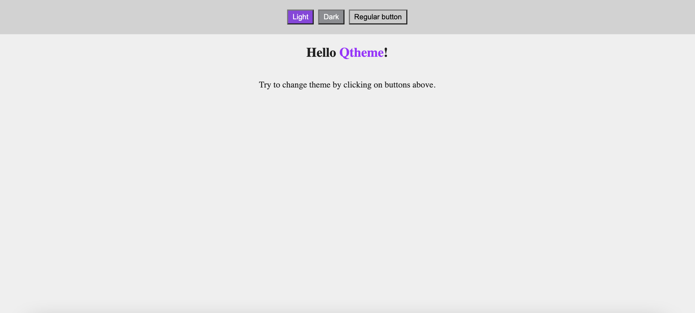

screenshotOf: this example project

# ngx-qhteme example
This project is made as an example usage of Angular library `ngx-qtheme`

## Where I can find ngx-qtheme package?
Package can be found on NPM, here: [ngx-qtheme](https://www.npmjs.com/package/ngx-qtheme)

Or simply type `ng add ngx-qtheme` within your-angular-project root folder

## How to install this example project?
1. `git clone` or download zip with this repo
2. Go into location of this project in the terminal
3. Install required dependencies `npm install`
4. Run application `ng serve --open`

Author Kacper Walczak
quak.com.pl
